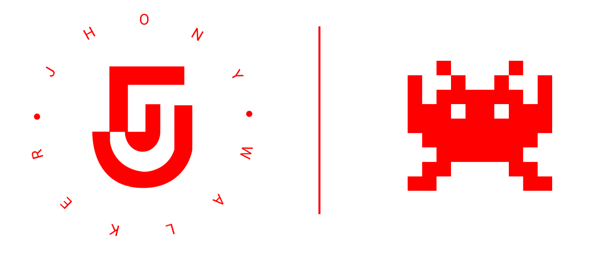

<h1 align="center">
    
</h1>

## 💻 Repository Summary

This repository is a compilation of all clone (and copyright) games I've created.

```text
⚠ THESE PROJECTS ARE FOR STUDY ONLY, NOT MALICIOUSLY USED
```

## 🚩 Navigating through projects

- [2048 Game](https://github.com/jhonywalkeer/games/tree/master/2048-game) - A clone of one of the most famous mobile games from 2048, the only difference is that this is the web version you have a new way to play. It was built using only HTML, CSS and Javascript.

- [Codepad - Among Us](https://github.com/jhonywalkeer/games/tree/master/among-us-codepad) - A clone of the mini game that is in Among Us where the objective is to select the correct pattern. It was built using only HTML, CSS and Javascript.

- [Fix Wiring - Among Us](https://github.com/jhonywalkeer/games/tree/master/fix-wiring-among-us) - A clone of the mini game that is in Among Us where the goal is to connect the wires. It was built using only HTML, CSS and Javascript.

- [T-rex Game](https://github.com/jhonywalkeer/games/tree/master/trex-game) - A clone of one of the most famous browser games that presents itself when you don't have internet on Google Chrome: T-rex Run. It was built using only React.js.

## 🛠 Technologies

Projects were built with different technologies and dependencies

## 🔨 Local Installation

You will need [GIT](https://git-scm.com/) in the most up-to-date version installed on your computer to continue.

```bash
git clone https://github.com/jhonywalkeer/games.git

$ cd games
$ code .
```

And now to run locally check the necessary requirements in the `README.md` of each project

## 📖 License

See the license assigned for each project in `README.md`
