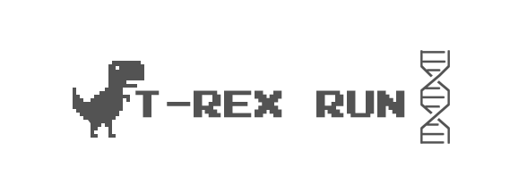

<h1 align="center">
    
</h1>

## 💻 Resumo do projeto

Um clone de um dos jogos de navegador mais famosos que se apresenta quando você não tem internet no Google Chrome: o T-rex Run.

```text
⚠ ESTE PROJETO É APENAS UM ESTUDO NÃO UTILIZADO DE MANEIRA MALIOSA
```

## 🛠 Tecnologias

Projeto foi construído utilizando **React.js** e nenhuma dependência adicional incorporada ao projeto.

## :video_game: How to play

Use as setas do teclado para mover o dinossauro para cima e para baixo e limpe a tecla de espaço para pular sobre os obstáculos


## 🔨 Instalação Local

Você precisará do [Node.js](https://nodejs.org) versão 10 ou superior, instalado no seu computador para continuar e o [Yarn](https://yarnpkg.com/).

```bash
git clone https://github.com/JhonyWalker-pixel/trex-game.git

$ cd t-rex-game
$ npm install
```

E agora para rodar nosso jogo localmente basta executar o seguinte comando:

```bash
$ cd t-rex-game
$ npm start
```

## 📖 License

Este projeto está sob a licença do MIT. Veja o arquivo [LICENSE](LICENSE.md) para mais detalhes.